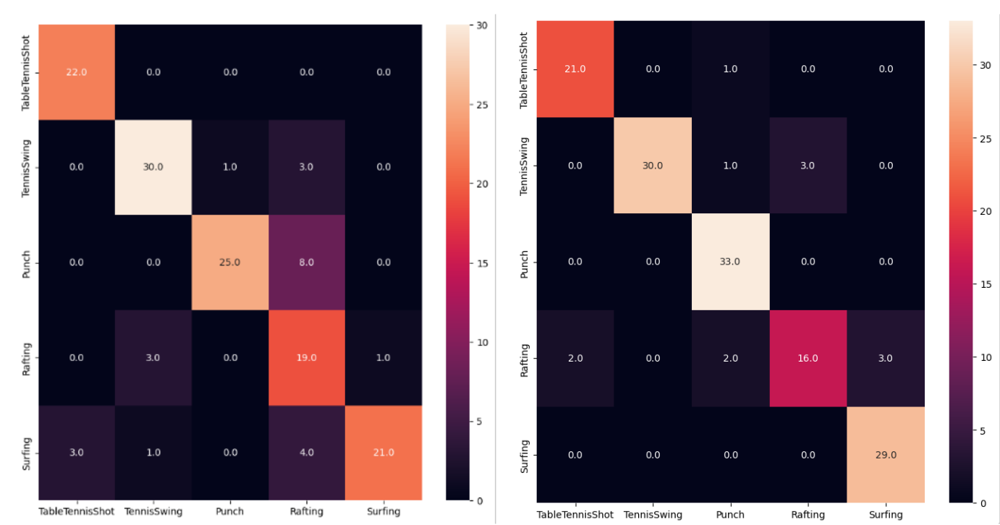
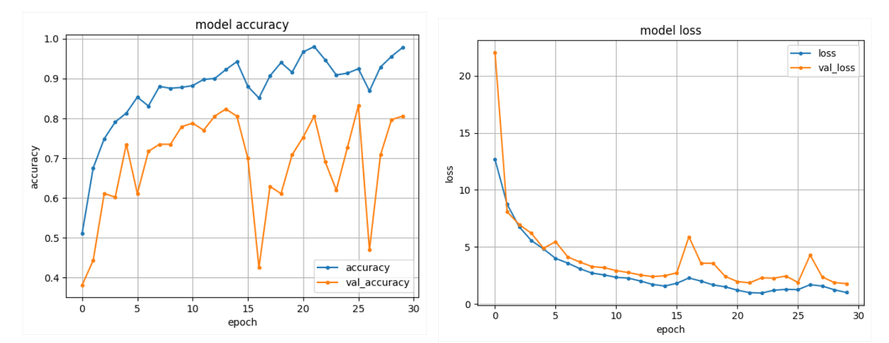
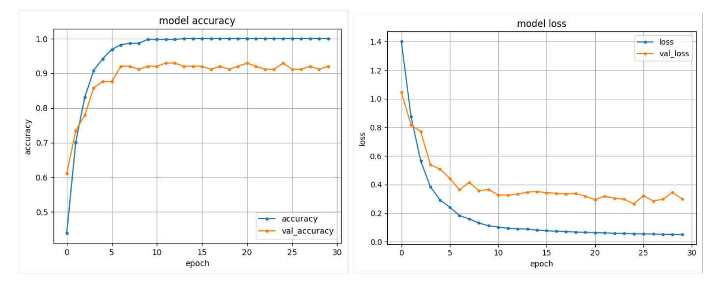

# Action Recognition

This repository includes 3D CNN and 2D CNN + LSTM models for video classification (or action recognition) using the UCF101 dataset with Keras. It takes videos as input, represented as tensors of either 3D images or consecutive 2D images, and performs classification on 5 classes ("TableTennisShot", "TennisSwing", "Punch", "Rafting", "Surfing") present in the UCF101 dataset.

## UCF-101 Dataset

[UCF-101](https://www.crcv.ucf.edu/data/UCF101.php) contains a total of 13,320 videos representing 101 different actions. The videos have varying durations in terms of frames and different sizes for their 2D images. In this study, a total of 703 videos from the UCF-101 dataset were used for 5 classes. Each video was sampled with 10 frames, resulting in 562 videos for the training set and 141 videos for the test set. The training set was further split, with 20% of it used as a validation set. 
Additionally, the address of the dataset used is as follows: [UCF-101.rar](https://www.crcv.ucf.edu/data/UCF101/UCF101.rar)

## Models
### 1. 3D CNN
- The 3D CNN model takes a tensor in the format of (samples, width, height, frames, channels) as input, where "samples" represents the number of videos and "frames" represents the number of frames in each video, with each frame having a width x height x channel dimension.

- After extracting temporal information using 3D CNN layers, the model has an MLP layer with a softmax activation function consisting of 5 neurons for label prediction.

### 2. 2D CNN + LSTM
- The CNN + LSTM model takes input tensors in the format of (samples, frames, width, height, channels).

- Since the model performs temporal information extraction using LSTM layers, after the feature extraction process for each frame, it is passed as input to the LSTM layer. The final layer consists of an MLP layer with softmax activation function, which has 5 neurons for label prediction.

## Conclusion

After a short training of 30 epochs, the results of the confusion matrices for the 3D CNN and LSTM models are expressed below.

### 3D CNN model train graph;

### 2D CNN + LSTM model train graph;
